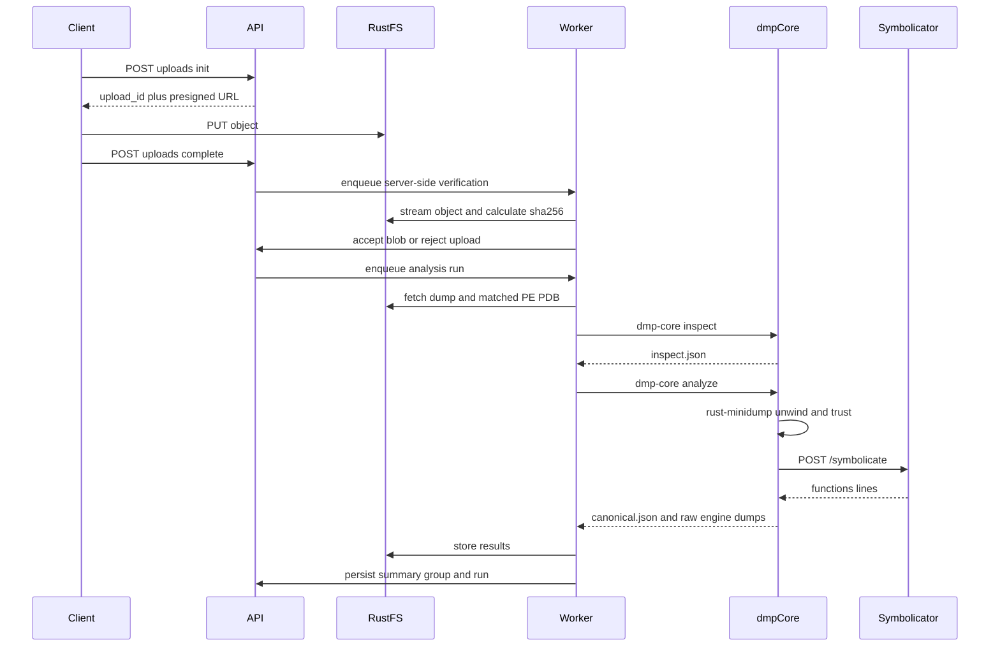

# Crash-Cap 设计文档

状态：Phase 0 本地技术验证已于 2026-08-21 通过硬门禁，稳定 `1.0` 机器契约、质量权重与 Exact 规则已经冻结；Phase 1 尚未实施。此次结论来自本地 Windows/Linux-container 验证，远端 GitHub Actions 尚未执行，不把本地结果冒充远端 CI 证明。

历史蓝图见 [miniprd.md](../miniprd.md)。**实现与评审以本文为准。** 机器可读契约：

- [analysis-result-v1.schema.json](../contracts/analysis-result-v1.schema.json)（稳定）
- [build-manifest-v1.schema.json](../contracts/build-manifest-v1.schema.json)（稳定）
- [task-message-v1.schema.json](../contracts/task-message-v1.schema.json)（稳定）
- [analysis-result-v0.schema.json](../contracts/analysis-result-v0.schema.json)、[build-manifest-v0.schema.json](../contracts/build-manifest-v0.schema.json)、[task-message-v0.schema.json](../contracts/task-message-v0.schema.json)（保留的 v0.1 草案兼容面）

领域语言见 [CONTEXT.md](../CONTEXT.md)，关键取舍见 [docs/adr/](adr/)，可勾选的实施顺序见 [渐进式实施路线图](implementation-roadmap.md)。

---

## 1. 已确认决策

1. **匿名内网**：Phase 1 无登录、用户、角色和权限设置；所有能访问平台的人可查看和操作全部工作空间。服务 MUST 仅部署在可信内网/VPN，MUST NOT 暴露公网。Web/API 不提供手工删除；原始二进制下载为部署级开关，默认关闭。
2. **工作空间**：一个 Workspace 对应一个程序或产品族。相同 SHA-256 的 DMP 在同一 Workspace 内代表同一 Occurrence；重新分析不创建新 Occurrence。Current Analysis 确认为 `crash` 的子集才进入崩溃次数。不同 Workspace 不共享业务去重或符号命名空间。
3. **Build**：Build 是一次精确编译产物集合，不等于版本标签。平台可按模块 ID 自动解析 Build；唯一命中才绑定，歧义或未命中必须显式呈现。人工确认的绑定不得被静默覆盖。
4. **队列与存储**：FastAPI + Dramatiq + Redis，PostgreSQL，RustFS，单实例 Symbolicator，Docker Compose。平台只依赖通过资格测试的标准 S3 API；RustFS 镜像按 digest 固定。
5. **前端**：React + TypeScript + Vite + Ant Design + TanStack Query。Phase 1 用轮询：分析中 2 秒、排队中 10 秒、页面不可见时停止；SSE 后置。
6. **符号**：私有符号使用 Workspace 级 Symbolicator Unified Layout；公共 SDK 使用显式共享 source；Microsoft 公共符号由部署开关控制、默认启用。请求方 MUST NOT 提交任意符号 URL。
7. **分组**：Exact Group 是 Phase 1 SHOULD，不是上线 MUST。仅在故障业务模块已匹配且至少存在一个非 `scan` 的 in-app 帧时自动入组；否则保留为 Unclassified Crash。Family、人工 merge/split 后置。
8. **文件与源码**：DMP 上限 256 MiB；无累计数量配额。Source bundle Phase 1 只保存、不消费；报告到 file/line。
9. **模块角色**：Manifest 模块角色为 `entrypoint | owned | dependency`，允许多个 entrypoint。`entrypoint/owned` 默认 `in_app=true`，dependency/系统模块默认 false；覆盖规则变更触发重新分析。
10. **Core**：最终实现为 Rust CLI + OCI；Phase 0 用 `minidump-stackwalk` 与 CDB 对照后，冻结「rust-minidump unwind + Symbolicator `/symbolicate`」和 Exact 16 字节相对地址分桶。
11. **Hang**：只有明确以 Hang 意图采集的 Dump 才是 `hang`；没有异常信息本身只能得到 `unknown`。Hang/Unknown 与 rejected uploads 不进入 Crash Occurrence 统计。
12. **契约**：Phase 0 使用过的 `0.1` 草案继续保留读取与回归能力；Golden 验证通过后发布的稳定 `1.0` 是 Phase 1 的唯一新写入契约。冻结后新增字段也必须发布新契约版本并保留旧版读取能力。

---

## 2. 目标、非目标与约束

### 2.1 目标

Crash-Cap 是部署在 Linux 上的 Windows 应用崩溃解析平台。Core 的产品不是一段格式化调用栈，而是**带证据、质量等级、版本信息和可解释分组依据的结构化事故报告**。

Phase 1 必须做到：

1. 按 Workspace 和 Version 统计确认的 Crash Occurrence；不同 DMP 内容算不同 occurrence，reprocess 不增加次数。
2. 手动上传 DMP，以及精确匹配的 PE / PDB；Build 可自动唯一解析，也允许 `ambiguous/unresolved`。
3. 解析异常、崩溃线程、全部线程、模块与符号状态。
4. 输出版本化 Canonical JSON，并在 UI 展示质量扣分原因。
5. 错误 PDB 明确标记 mismatch，MUST NOT 静默符号化；有效 DMP 仍可产出 `PARTIAL`。
6. Analysis Run 不可变；后补符号可 reprocess，当前统计只使用 occurrence 的 Current Analysis。
7. 有足够证据时自动 Exact 入组；证据不足时明确显示 Unclassified，不阻塞首版上线。

### 2.2 非目标（Phase 1 MUST NOT 实现）

- .NET Dump、内核 Dump、完整堆内存分析、WinDbg 扩展、`!analyze -v` 兼容输出
- 自研 PDB / unwind 解析器
- 接入完整 Sentry 产品
- 以 Breakpad `.sym` 为主符号化路径
- Windows CDB Worker
- Family 模糊合并、人工 merge/split、回归检测、缺陷系统联动
- Hang 多采样会话与死锁证明
- ClickHouse、OpenSearch、Kubernetes 生产 YAML
- Source bundle 源码上下文（见 §1 决策 8）
- 登录、用户、角色、RBAC、多租户与 SSO
- Web/API 手工删除

### 2.3 硬约束

1. 第一版只做 **Windows 原生 C/C++ 用户态 x64 Minidump**。
2. 运行与解析平台全部在 Linux。
3. **对外契约只有平台 Canonical JSON**。Symbolicator 与 rust-minidump 是内部依赖，其原始 JSON 单独落对象存储，MUST NOT 作为 Web API 稳定字段。
4. Core 第一版是 **版本化 Rust CLI + OCI 镜像**，由隔离 Worker 调用，不是常驻 HTTP 服务。
5. API 进程 MUST NOT 中转或解析 DMP / PDB / PE 字节流；上传走对象存储预签名。
6. `analysis_run` 不可变；禁止覆盖旧结果。
7. 主存储为 PostgreSQL + RustFS（S3 adapter）+ Redis。
8. RustFS Bucket MUST 私有；浏览器只能拿到短 TTL、限定对象和动作的预签名 URL。
9. 稳定契约版本为 `1.0`，HTTP API 前缀为 `/api/v1`；`0.1` 仅作为历史草案兼容面，不得用于 Phase 1 新写入。
10. 原始 DMP 默认保留 180 天且可按 Workspace 配置；Occurrence 元数据与分析摘要长期保留，原始对象过期不得减少历史崩溃次数。

### 2.4 口径

- **MUST / MUST NOT**：实现与评审的硬规则。
- **校准项**：Phase 0 用真实样本调整后再冻结数值；Schema 仍输出对应字段。
- **预留**：字段或表存在，Phase 1 不实现写入逻辑或恒为 `null`。

---

## 3. 术语与标识规范

### 3.1 名称

本节是实现索引；规范领域定义以 [CONTEXT.md](../CONTEXT.md) 为准。

| 术语 | 含义 |
| --- | --- |
| Core / `dmp-core` | 版本化 CLI，负责 inspect / match / unwind / 请求符号化 / 归一化 / 质量 / 指纹 |
| WebPlatform | 工作空间、上传、任务、检索、展示；不认证用户、不解析二进制 |
| Worker | 拉任务、落盘、起沙箱跑 `dmp-core`、回写结果 |
| Symbolicator | 内部符号化引擎，不是对外契约 |
| Canonical JSON | 稳定 `analysis-result-v1`，平台唯一对外分析结果；v0.1 只保留兼容读取 |
| workspace | 一个程序或产品族的版本、Build、Occurrence 与符号命名空间 |
| build | 一次具体编译产物集合，不是产品版本号 |
| artifact | 一个 PE、PDB 或（预留）source bundle |
| dump_blob | 经过验收的不可变 DMP 字节对象 |
| occurrence | 同一 Workspace 内一个不同且已验收 DMP 内容；Current Analysis 决定它是 crash、hang 或 unknown |
| analysis_run | 对某个 occurrence 的一次不可变分析 |
| current_analysis | 当前统计与分组使用的成功或部分成功 run |
| in_app | 模块角色为 `entrypoint/owned` 的业务帧 |

### 3.2 `code_id`

Windows PE 的 Code ID，**只能从 PE 读取，不能从 PDB 反推**。

```text
code_id = upper(hex(TimeDateStamp, 8)) + upper(hex(SizeOfImage))   # SizeOfImage 不补零
```

- `TimeDateStamp`：COFF 头，格式 `%08X`
- `SizeOfImage`：Optional Header，格式 `%X`（可变长度）
- 存储：去掉 `0x` 前缀的大写十六进制连续字符串，例如 `67A1B9231F000`
- Dump 模块列表里的 code_id 与 PE 解析结果比较时 MUST 大小写不敏感，入库统一大写

### 3.3 `debug_id`

PDB Debug ID（Sentry / Breakpad 兼容），由 PDB 7.0（RSDS）的 GUID + age 构成。

1. 读取 GUID 的四个字段；`Data1` / `Data2` / `Data3` 转为网络字节序后再十六进制化，`Data4` 按原字节序。
2. 拼接 32 位十六进制 GUID（无连字符）与 age 的未补零十六进制。
3. 存储：**全小写、无连字符**。示例：`b0c27c20a4704c4fa6f2b706d29f7e031`
4. UI 可另显 `{B0C27C20-A470-4C4F-A6F2-B706D29F7E03} age=1`，那是展示层，不是存储键。

PE 的 CodeView RSDS 记录也能算出同一 `debug_id`。匹配时 MUST 用该值，MUST NOT 用 PDB 文件名或产品版本。

### 3.4 Dump 种类与采集剖面

`dump.kind`：

- `user_minidump`：当前唯一支持的文件类型
- 预留：`kernel`、`unknown_binary`（Phase 1 遇到则 `REJECTED`）

`crash.type`：

- `crash`：存在异常 / 崩溃线程
- `hang`：上传方明确声明 Hang 采集意图，且输入是用户态 Minidump
- `unknown`：没有足够证据确认 crash 或 hang；缺异常 stream 时 MUST 使用本值而不是推断 hang

`capture_profile` 仅为元数据标签，Phase 1 不强制客户端 SDK：

- `light-crash`
- `rich-crash`
- `hang`
- `full-memory`（Phase 1 上传 MUST 拒绝，见 §1 决策 8）

### 3.5 系统模块否认名单（`in_app=false` 的下限）

文件名（大小写不敏感，匹配 basename）包括但不限于：

```text
ntdll.dll, kernel32.dll, kernelbase.dll, user32.dll, gdi32.dll
ucrtbase.dll, vcruntime140.dll, vcruntime140_1.dll, msvcp140.dll
msvcrt.dll, advapi32.dll, sechost.dll, rpcrt4.dll, ole32.dll
combase.dll, ws2_32.dll, bcryptprimitives.dll, win32u.dll
```

本名单用于识别系统模块，但模块角色才是 `in_app` 的权威：`entrypoint/owned=true`，`dependency/system=false`。管理员通过部署配置覆盖时 MUST 记录规则版本并触发 reprocess；单纯 ingest 过某个 `debug_id` 不足以令其成为 in-app。

### 3.6 质量等级（派生展示）

Canonical JSON MUST 输出 `quality.score`（0–1 的浮点）及三个分项。字母等级仅 UI 派生，不入库为权威字段：

```text
A  score >= 0.90
B  0.75 <= score < 0.90
C  0.50 <= score < 0.75
D  score < 0.50
```

分项权重已由 Phase 0 F04 冻结，见 §7.6；字母展示阈值仍不是 Canonical 契约字段。

---

## 4. 逻辑架构与物理部署

### 4.1 逻辑

```text
Core          这个 DMP 发生了什么 → 可复现的 Canonical JSON
WebPlatform   文件如何进入、任务如何运行、结果如何检索和展示
```

### 4.2 物理（Phase 1 Compose）

```text
Browser / CLI
      │
      v
 Intranet Gateway（TLS/路由，可选 nginx；不做用户鉴权）
      │
      v
 FastAPI 控制面 ── PostgreSQL（元数据）
      │         ── Redis（Dramatiq / 锁 / 短缓存）
      │
      ├── 预签名 ── RustFS（DMP / PE / PDB / 分析结果）
      │
      └── enqueue ── Dramatiq Worker
                        │
                        ├── docker run dmp-core（只读根、限资源、仅内网）
                        │         └── HTTP ── Symbolicator
                        │                         ├── 私有 Unified 符号卷
                        │                         └── 可选 Microsoft 符号（egress allowlist）
                        └── 回写 PG + RustFS
```

逻辑面与进程对应：

| 逻辑面 | Phase 1 进程 |
| --- | --- |
| 控制面 | FastAPI |
| 文件面 | RustFS（私有 Bucket；S3 endpoint 仅经内网 TLS 入口提供预签名访问） |
| 任务面 | Dramatiq + Redis |
| 解析面 | `dmp-core` 一次性容器 |
| 符号面 | Symbolicator + 符号 PVC/卷 |
| 查询展示面 | FastAPI 读模型 + React |
| Windows 深度分析面 | 不部署 |

### 4.3 仓库结构

```text
crash-cap/
├── core/                         # Rust workspace，独立构建发布
├── platform/
│   ├── api/
│   ├── worker/
│   ├── frontend/
│   └── cli/
├── contracts/
├── fixtures/                     # Golden Dump，Phase 0 起积累
├── deploy/compose/
└── docs/design.md
```

Core 与 Platform 同 monorepo，分别出镜像。

---

## 5. 端到端主路径



### 5.1 构建产物路径

1. 创建 `build`（平台生成 `build_id`）。
2. 上传或填写 `build-manifest.json`；每个模块声明 `entrypoint | owned | dependency`，至少一个 entrypoint。
3. 对每个 PE/PDB：`uploads:init` → 直传 RustFS → `complete`。
4. Verification Worker 流式计算服务端 SHA-256；客户端哈希只作提示。
5. Worker 跑 ingest：读 ID、PE↔PDB 校验、拒 FASTLINK、写 raw 对象、`symsorter` 进 Workspace Unified 布局、登记 `artifacts`。
6. 符号库存版本 `symbol_inventory_version` 递增（见 §9.4）。

### 5.2 Dump 路径

1. `dumps/uploads:init` → 直传 → `complete`。
2. Verification Worker 校验大小（≤ 256MiB）、魔数并流式计算 SHA-256。
3. 同 Workspace 已存在相同 SHA-256 时复用 `dump_blob_id` 和 `occurrence_id`；重复上传与 reprocess 均不增加崩溃次数。不同 Workspace 不复用业务对象。
4. 新内容创建一个 Occurrence，保存 `dump_timestamp/reported_at/uploaded_at/occurred_at/time_source`。
5. 创建不可变 Analysis Run Spec，入队 inspect → resolve build → match → analyze → normalize → 可选 Exact grouping。
6. 前端轮询 occurrence/current run 状态。

---

## 6. 输入契约

### 6.1 正式输入

可靠 x64 栈展开 MUST 尽量同时具备：

- DMP（用户态 Minidump）
- 与模块 **精确匹配** 的 PDB
- 与模块 **精确匹配** 的 EXE/DLL（提供 `.pdata/.xdata`）

Build 元数据：

- `build-manifest.json` 由 Phase 1 API 校验并消费，用于 Version、模块角色和自动 Build Resolution；它不是二进制 Artifact
- 没有 Manifest 时仍可 ingest PE/PDB 和分析 Dump，但 Build Resolution 只能为 manual/unresolved，不能自动猜角色
- source bundle 可选；Phase 1 只存 raw，MUST NOT 送入 Symbolicator

缺少 PE：允许继续分析，但 MUST 降 `unwind_reliability` 并写 warning `missing_pe`。  
缺少业务 PDB：MUST 标记 `missing_pdb`，结果可为 `PARTIAL`，MUST NOT 当作 `FAILED`。  
错误 PDB：MUST `pdb_mismatch`，MUST NOT 用该 PDB 符号化对应模块。

### 6.2 推荐 CI 包布局（文档规范，API 不强制 zip 整包）

```text
build-package/
├── build-manifest.json
├── bin/
│   ├── app.exe
│   └── engine.dll
├── symbols/
│   ├── app.pdb
│   └── engine.pdb
└── source-bundle.zip          # Phase 2
```

Phase 1 API 按单文件 artifact 上传。CLI 可在本地拆包后逐个调用。

### 6.3 `build-manifest.json`

稳定契约见 `contracts/build-manifest-v1.schema.json`；v0.1 草案仅用于兼容测试。平台在 ingest 后把真实 `code_id` / `debug_id` / `sha256` 写入 `artifacts`，**不信任清单里手填的 ID**。

清单用途：产品版本、commit、模块逻辑名、模块角色、架构/工具链展示。至少一个模块 MUST 为 `entrypoint`。  
MUST NOT 用 `version` 字段匹配符号。

CI MUST 产出完整 PDB。`/DEBUG:FASTLINK` PDB MUST 在 ingest 被拒绝（`verification_status=rejected_fastlink`）。

### 6.4 文件验收

| 种类 | 魔数 / 格式 | Phase 1 大小上限 |
| --- | --- | --- |
| DMP | `MDMP`（`MDMP` / MiniDump 头） | 256 MiB |
| PE | `MZ` + PE 签名 | 512 MiB |
| PDB | PDB 7.0（`Microsoft C/C++ MSF 7.00`） | 2 GiB |
| ZIP | 仅用于后续 source bundle；Phase 1 若上传则只存 raw | 512 MiB |

另 MUST 检查：解压层数与爆炸比（zip）、路径穿越、空文件、声明大小与对象存储 `Content-Length` 一致。

---

## 7. Core 设计

### 7.1 形态

`dmp-core` 是无状态 CLI。每次任务一个工作目录。镜像 digest 写入 `analysis_runs.core_image_digest`。

```bash
dmp-core inspect \
  --dump /work/input.dmp \
  --output /work/inspect.json

dmp-core analyze \
  --dump /work/input.dmp \
  --inspect /work/inspect.json \
  --match /work/match.json \
  --symbolicator http://symbolicator:3021 \
  --output /work/result.json \
  --raw-dir /work/raw
```

Phase 1 MUST NOT 提供 Core HTTP/gRPC。

退出码：

| 码 | 含义 | 平台映射 |
| --- | --- | --- |
| 0 | 成功（含 PARTIAL 质量） | `COMPLETE` 或 `PARTIAL` |
| 2 | 不支持的 dump | `REJECTED` |
| 3 | 输入损坏/截断 | `REJECTED` |
| 10 | 超时（由包装层 kill 后归类） | `TIMEOUT` |
| 137 / OOM | 包装层归类 | `OOM` |
| 其他非 0 | 引擎失败 | `FAILED` |

`PARTIAL` 由 Worker 根据 Canonical JSON 的 warnings / 缺失符号决定，不单独用退出码表示「缺第三方 PDB」。

### 7.2 Unwind 权威来源（Phase 0 验证）

两条路径会走出两套栈，必须选定权威：

- Symbolicator `POST /minidump` 内部也用 rust-minidump，但公开响应 **不保证** 提供 frame `trust`
- rust-minidump JSON 提供 `trust`: `context | cfi | frame_pointer | scan`

**Phase 1 默认（§1 决策 10 + 本节）**：

```text
inspect:  仅 rust-minidump，不访问符号
analyze:  rust-minidump 负责 unwind + trust
          Worker 把已匹配 PE（及可选 PDB/breakpad 派生）放到本地符号路径供 unwind
          Symbolicator 只走 POST /symbolicate，按 instruction_addr 填函数/文件/行号
          dmp-core 按 instruction_addr（及模块）对齐合并
```

MUST NOT 把 Symbolicator `request_id` 当作平台任务 ID。`pending` 后 404 MUST 整单重提符号化请求。

Phase 0 若证实 `/minidump` 响应已含等价 trust，允许改为单次 `/minidump`；须更新本节并 bump `core` 次版本。对外 Canonical JSON 不变。

x64 缺 PE 时 unwind 退化是预期行为：warning `missing_pe_unwind`，不是 `FAILED`。

### 7.3 模块

#### dump-inspector

- 确认用户态 Minidump；非此格式 → 退出码 2
- 提取架构，非 `x86_64` / `Amd64` → 退出码 2（Phase 1）
- 进程、OS、异常线程、异常代码、模块列表、线程上下文
- 识别 `crash`；只有上传元数据明确声明 Hang 意图时才标 `hang`；缺异常信息本身标 `unknown`
- 识别截断、缺少必要 stream → 退出码 3 或 warning（有部分线程则尽量继续）

字段视为可选：Minidump 是尽力而为格式，以 rust-minidump 为准。

#### artifact-matcher

对每个 dump 模块输出：

```text
code_file, code_id, debug_file, debug_id, image_base, image_size, status
```

`status` 枚举：

```text
matched
missing_pe
missing_pdb
pdb_mismatch
pe_mismatch
corrupted
system_symbol_pending
unsupported
```

规则：

- MUST NOT 按文件名或产品版本自动匹配
- MUST NOT 因该版本只有一个 PDB 就强行使用
- 系统模块无本地符号时可 `system_symbol_pending`，由 Symbolicator 按管理员配置的 Microsoft 源尝试
- 同一产品版本允许多次构建；匹配键只有 `code_id` / `debug_id`

Build Resolution 使用 Workspace 内已登记模块的交集：

1. 唯一 Build 命中至少一个 `entrypoint`，且 Dump 中已出现的 `owned` 模块无冲突 → `auto_unique`
2. 多个 Build 均满足 → `ambiguous`，保存候选与证据，不猜版本
3. 无 Build 满足 → `unresolved`，仍允许输出报告
4. 上传方可给 `reported_build_id`；人工确认得到 `manual`，后续 reprocess MUST NOT 静默覆盖
5. 每个 Analysis Run 保存自己的 `resolved_build_id`、`resolution_method` 与证据

#### symbolication-adapter

- 组装 Symbolicator `POST /symbolicate` 请求（绝对地址 + 模块列表）
- `timeout` 查询参数；处理 `pending` / 重提
- `sources` 只使用部署配置的 allowlist，MUST NOT 使用请求方 URL
- 原始响应写入 `raw/symbolicator.json`

#### stack-quality-evaluator

每个 frame 记录 `trust`：`context | cfi | frame_pointer | scan | unknown`。

可信度序：`context / cfi > frame_pointer > scan`。

#### normalizer

合并 rust-minidump 元数据、符号化结果、build/symbol 元数据 → Canonical JSON。地址一律十六进制字符串。原始函数名与归一化函数名分字段保存。

#### fingerprint-and-cluster

Phase 1 只实现 Exact（§7.7）。Family 算法描述见 §15 Phase 3，Phase 1 MUST NOT 自动按相似度合并。

### 7.4 Canonical JSON 字段纪律

稳定 schema：`contracts/analysis-result-v1.schema.json`；`contracts/analysis-result-v0.schema.json` 保留用于旧草案读取与交叉版本负例测试。

要点：

- Phase 1 新结果的 `schema_version` 恒为 `"1.0"`；v0.1 payload 不得通过 v1 Schema，v1 payload 也不得通过 v0 Schema
- `workspace_id`、`occurrence_id`、`analysis_id`、Build Resolution MUST 存在
- 地址：`0x` 前缀小写十六进制字符串
- `engine.core_image_digest`、`symbolicator_version`、`grouping_version` MUST 存在
- `threads` / `modules` / `quality` / `fingerprints` MUST 存在；Hang/Unknown 时 `fingerprints.exact` MUST 为 `null`
- Raw 引擎输出不进本对象，由 Worker 另存

### 7.5 函数名归一化（Phase 1 最小集）

用于指纹与展示的 `function_normalized`：

1. 采用 Symbolicator `function`（demangle 短名），缺失则用 rust-minidump 符号，再缺失则 `module+relative`
2. `norm-v1.0` 去掉参数列表，并截断 MSVC `::<lambda_...` 编译器生成尾；后续规则变化必须发布新 normalization/grouping 版本
3. 保留命名空间与类名：`Renderer::SubmitFrame`

Phase 1 MUST NOT 过滤 CRT/OS 帧之外的「异步包装层白名单」——那是 Family 的 Phase 3 工作。Exact 取帧时仍丢掉否认名单与 `trust=scan` 且无上下文佐证的帧。

### 7.6 质量分（v1 已冻结）

```text
symbol_coverage      = 已符号化 in_app 帧 / 可识别 in_app 帧
unwind_reliability   = Σ trust_weight / frame_count   # 崩溃线程，无则主线程
artifact_completeness= 精确匹配(matched) 的 in_app 模块 / dump 中 in_app 模块
```

稳定 v1 权重：

```text
context 1.00  cfi 1.00  frame_pointer 0.75  scan 0.20  unknown 0.00

quality_score = 0.45 * symbol_coverage
              + 0.35 * unwind_reliability
              + 0.20 * artifact_completeness
```

分母为 0 时该分项记 `0` 并 warning。UI MUST 展示 warnings 原文，不得只给字母。

### 7.7 Exact Fingerprint（Phase 1）

用于「同一构建中的相同崩溃」。

前置：`crash.type == crash`、存在崩溃线程、故障模块精确匹配，并至少存在一个非 `scan` 的 in-app 帧。任一条件不满足时 `fingerprints.exact = null`，Occurrence 保持 Unclassified。

有效业务栈：

1. 去掉 OS / CRT 否认名单帧
2. 去掉 `trust=scan` 且无法被相邻 `context/cfi` 佐证的帧
3. 去掉重复 inline 物理帧（同一 `instruction_addr`）
4. 取前 5 个剩余 in_app 帧；不足 5 个则用全部剩余帧

MUST NOT 回退到系统/第三方帧构造弱指纹；分类率不是强行合并的理由。

Frame token：

```text
debug_id + "\n" + function_normalized + "\n" + hex(relative_addr & ~0xF)
```

相对地址 16 字节分桶已由 Phase 0 F06 校准并冻结到 `exact-v1.0`。`instruction_addr - module.image_base` 得 `relative_addr`；无精确模块时不生成 Exact。

```text
exact = sha256_hex(
  workspace_id + "\n" +
  exception_code + "\n" +
  access_type + "\n" +   # 无则 "-"
  fault_module_debug_id + "\n" +
  token_0 + ... + token_n
)
```

`workspace_id` 是分组命名空间，Version 仅用于聚合展示。  
稳定 `algorithm` 字段为 `exact-v1.0`。变更分桶或过滤规则 MUST 发布新算法与 `grouping_version`，不得改写 v1 语义。

Family 指纹 Phase 1 恒 `null`，字段保留。

---

## 8. 符号仓库

### 8.1 两层存储

**原始层**（不可变字节）：

```text
raw-builds/{workspace_id}/{build_id}/manifest.json
raw-builds/{workspace_id}/{build_id}/files/{sha256}
```

**Symbolicator 层**（Unified Layout，由 `symsorter` 生成）：

```text
sym-unified/{workspace_id}/{debug_id[0:2]}/{debug_id[2:]}/debuginfo
sym-unified/{workspace_id}/{debug_id[0:2]}/{debug_id[2:]}/executable
```

具体子路径以固定版本的 `symsorter` 与 Symbolicator Unified 文档为准；平台保证按 Workspace 隔离前缀。

### 8.2 Ingest 流程

```text
上传 PE/PDB
  → 读 code_id / debug_id
  → FASTLINK → reject
  → PE 与 PDB 成对校验（RSDS GUID+age）
  → sha256
  → 写 raw-builds
  → symsorter 写入 Unified
  → INSERT artifacts
  → bump symbol_inventory_version
```

成对校验：若同一次 build 同时有 PE 与 PDB，其 `debug_id` MUST 相等，否则两件都标 `pdb_mismatch` / `pe_mismatch`，MUST NOT 进入 Unified。只上传 PDB、稍后补 PE：PDB 可先入库符号化；补 PE 时再校验，失败则 PE `rejected`，已入库 PDB 保持，但该模块匹配状态在新分析中反映 mismatch。

### 8.3 查找优先级（Symbolicator sources 顺序）

1. 当前 Workspace 私有 Unified
2. 显式配置的公司公共 SDK source（与 Workspace 前缀分离；无则省略）
3. Microsoft 公共符号（管理员开关，默认开）

MUST NOT 使用用户提交 URL。Symbolicator 进程是唯一允许访问外部符号源的组件；`dmp-core` 只访问内网 Symbolicator。

### 8.4 缓存

每个 Symbolicator 实例使用本地持久卷。Phase 1 单实例即可。多实例时不假设 RustFS 能当官方 shared-cache（文档以 GCS 为主）；用粘性路由或继续单实例。

`scope` 参数 MUST 带 `workspace_id`；公共 SDK 使用独立 scope。即使没有用户权限，也不能因缓存键串扰而错误符号化。

---

## 9. WebPlatform

### 9.1 职责边界

负责：工作空间、构建、预签名上传、任务编排、状态机、结果持久化、可选 Exact 分组、符号缺失登记、前端 API、匿名操作日志。

MUST NOT：在 API 进程内解析 DMP/PDB、执行调试器、下载符号、在请求线程生成完整报告文件。

Phase 1 无登录、用户、角色、RBAC 或 Workspace membership。所有访问者均可查看、上传、创建 Workspace/Build、触发 reprocess 和编辑非破坏性 Group 元数据。Web/API MUST NOT 提供 DELETE。

原始 DMP / PE / PDB 下载由部署级 `RAW_DOWNLOAD_ENABLED` 控制，默认 false；启用后所有访问者都能下载，因此只能在可信内网使用。RustFS 自身仍必须鉴权，浏览器不得获得长期存储凭证。

### 9.2 上传状态

```text
INITIALIZED → UPLOADING → UPLOADED → VERIFYING
    → ACCEPTED | QUARANTINED | REJECTED
```

`complete` 时进入 `VERIFYING`。Verification Worker MUST 从 RustFS 流式读取对象并计算服务端 SHA-256；HeadObject 只校验长度，客户端哈希不是权威。hash/大小/魔数失败 → `REJECTED`。可疑但需人工（Phase 1 不用）→ `QUARANTINED`。

记录字段：`workspace_id, object_key, original_filename, declared_length, verified_length, client_sha256_hint, verified_sha256, uploaded_at, source_ip, file_kind, verification_status`。

`file_kind`：`dmp | pe | pdb | source_bundle`。Manifest 是 Build 元数据，通过独立 JSON API 校验，不进入 artifact ingest 队列。

### 9.3 分析状态机

主路径：

```text
UPLOADED
  → VALIDATING
  → INSPECTED
  → MATCHING_SYMBOLS
       ├─ WAITING_FOR_SYMBOLS     # 业务模块全部 missing_pe 且 missing_pdb 时可停
       └─ SYMBOLS_READY
            → QUEUED
            → ANALYZING
            → NORMALIZING
            → GROUPING
            → COMPLETE | PARTIAL
```

Phase 1：若至少有一个 in_app 模块 `matched` 或仅系统模块可走 Microsoft 源，则不要进入长时间 `WAITING_FOR_SYMBOLS`；缺符号直接分析并 `PARTIAL`。`WAITING_FOR_SYMBOLS` 留给「工作空间策略要求必须等符号」的开关，默认关闭。

异常终态：`FAILED | REJECTED | CANCELLED | TIMEOUT | OOM`。

`PARTIAL` 是正常业务终态：异常与业务栈已产出，但存在 missing/mismatch/系统符号失败等 warnings。MUST NOT 把「缺某个第三方 PDB」映射为 `FAILED`。

合法迁移（实现必须拒绝未列出的跳跃）：

| 从 | 到 | 触发者 |
| --- | --- | --- |
| UPLOADED | VALIDATING | Worker |
| VALIDATING | INSPECTED | inspect 成功 |
| VALIDATING | REJECTED | 非 x64 / 非 minidump / 损坏 |
| INSPECTED | MATCHING_SYMBOLS | Worker |
| MATCHING_SYMBOLS | SYMBOLS_READY | matcher |
| MATCHING_SYMBOLS | WAITING_FOR_SYMBOLS | 策略开启且无任何业务符号 |
| WAITING_FOR_SYMBOLS | MATCHING_SYMBOLS | 补传符号 / 手动重试 |
| SYMBOLS_READY | QUEUED | Worker |
| QUEUED | ANALYZING | Worker 领取 |
| ANALYZING | NORMALIZING | dmp-core 退出 0 |
| NORMALIZING | GROUPING | 写入 canonical |
| GROUPING | COMPLETE | 无 blocking warning |
| GROUPING | PARTIAL | 有 missing/mismatch 等 |
| ANALYZING | TIMEOUT / OOM / FAILED | 包装层 |
| 任意非终态 | CANCELLED | 任意平台访问者 |

上传/Blob 验收状态与 Analysis Run 状态 MUST 分开存储。Occurrence 只引用 `current_run_id`；API 可返回组合视图，但 MUST NOT 把 run 状态复制同步到 Blob/Occurrence。

### 9.4 重新分析

触发：补传 PDB/PE、Core 镜像升级、Symbolicator 升级、normalization/grouping 版本升级、in_app 规则变更、新增 source bundle（Phase 2）。

一个 Occurrence 对应多个 `analysis_run`，`occurrences.current_run_id` 只指向最新 COMPLETE/PARTIAL run。失败的 run 保留但不切换 current；若从未有 COMPLETE/PARTIAL，则 current 为 null，API 另显 latest attempt。

实时统计只计算每个 Occurrence 一次，并读取 Current Analysis 的 crash type、Version、Build 与 Group。新 run 可令 occurrence 从旧组移到新组，但总崩溃数不变；旧成员关系写入追加式历史表。

幂等键：

```text
idempotency_key = sha256_hex(
  occurrence_id + "\n" +
  resolved_build_id_or_dash + "\n" +
  symbol_inventory_version + "\n" +
  core_image_digest + "\n" +
  symbolicator_version + "\n" +
  normalization_version + "\n" +
  grouping_version + "\n" +
  force_salt_or_dash
)
```

相同键 MUST NOT 再跑分析，返回已有 run。`symbol_inventory_version` 为 Workspace 级单调整数，每次成功 ingest 工件 +1。强制 reprocess 创建带 salt 的新 spec，但仍不创建新 occurrence。

队列消息不是执行规格的权威。API 必须先持久化不可变 Analysis Run Spec（输入 Blob、Build resolution、artifact IDs/hashes、Core digest、Symbolicator/normalization/grouping 版本），队列只传 `run_id`、`attempt_id` 与 routing；Worker 按 `run_id` 读取快照。

### 9.5 队列

Dramatiq actor 分队列：

| 队列 | 条件 | Worker 资源建议 |
| --- | --- | --- |
| `verify` | RustFS 对象验收、服务端 SHA-256 | 1 CPU / 2GiB；流式读取 |
| `dump-small` | size ≤ 64MiB | 2 CPU / 4GiB / 10min |
| `dump-large` | 64–256MiB | 2 CPU / 8GiB / 20min |
| `dump-huge` | > 256MiB | Phase 1 不入队 |
| `ingest` | PE/PDB | 1 CPU / 4GiB / 15min |

超时与 cgroup 内存击穿分别记 `TIMEOUT` / `OOM`。

Phase 1 没有累计 Dump 数配额。`100 dumps/day、峰值 5 个任务` 是容量基线，不是业务上限；超出时排队而不是丢弃。基线负载下，≤64MiB 端到端 p95 目标 10 分钟，64–256MiB 目标 20 分钟；Microsoft 冷符号首次下载单独度量。

---

## 10. 数据模型

PostgreSQL。时间一律 `timestamptz`。ID 使用带前缀的 ULID 字符串：`wsp_ / bld_ / mod_ / art_ / blob_ / occ_ / run_ / grp_ / upl_`。

完整 threads/frames MUST NOT 拆成关系表。PG 存摘要 + 崩溃线程 top 15 frames（JSONB），完整 Canonical JSON 在 RustFS。Phase 1 没有 tenants/users/roles 表。

### 10.1 `workspaces`

| 列 | 类型 | 约束 |
| --- | --- | --- |
| id | text | PK |
| name | text | 稳定 slug |
| display_name | text | |
| platform | text | Phase 1 恒 `windows` |
| default_architecture | text | 恒 `x86_64` |
| retention_days | int | 默认 180 |
| symbol_inventory_version | bigint | 默认 0 |
| created_at | timestamptz | |
| UNIQUE | (name) | |

一个 Workspace 对应一个程序或产品族。`retention_days` 仅控制原始 Dump Blob，默认 180；Occurrence 与分析摘要不随 Blob 过期而删除。

### 10.2 `builds`

| 列 | 类型 | 约束 |
| --- | --- | --- |
| id | text | PK，平台生成 |
| workspace_id | text | FK |
| version | text | 展示用，**非唯一** |
| build_number | text | 可空 |
| commit_sha | text | 可空 |
| channel | text | 可空 |
| architecture | text | 默认 `x86_64` |
| toolchain | text | 可空，如 `msvc` |
| manifest_object_key | text | 可空 |
| created_at | timestamptz | |

MUST NOT 建 `UNIQUE(workspace_id, version)`。

索引：`(workspace_id, created_at DESC)`。

### 10.3 `build_modules`

| 列 | 类型 | 约束 |
| --- | --- | --- |
| id | text | PK |
| build_id | text | FK |
| code_file | text | basename |
| debug_file | text | basename |
| role | text | `entrypoint \| owned \| dependency` |
| code_id | text | ingest 后可空/回填 |
| debug_id | text | ingest 后可空/回填 |
| created_at | timestamptz | |

每个 Build MUST 至少有一个 `entrypoint`。`entrypoint/owned` 默认生成 `in_app=true`；dependency 默认 false。

### 10.4 `artifacts`

| 列 | 类型 | 约束 |
| --- | --- | --- |
| id | text | PK |
| build_id | text | FK |
| module_id | text | FK，可空（source bundle） |
| kind | text | `pe \| pdb \| source_bundle` |
| logical_name | text | 原始文件名 basename |
| sha256 | char(64) | NOT NULL |
| size | bigint | |
| object_key | text | raw 路径 |
| code_id | text | PE MUST 有；PDB 可空 |
| debug_id | text | PDB MUST 有；PE 有 RSDS 则 MUST 有 |
| verification_status | text | 见下 |
| created_at | timestamptz | |

`verification_status`：`pending | verified | rejected_fastlink | pdb_mismatch | pe_mismatch | corrupted | rejected_format`。

索引：`(debug_id)`, `(code_id)`, `(sha256)`。同一 Workspace 内相同内容可复用物理对象但仍分别关联 Build；MUST NOT 让跨 Workspace 去重影响可见性或符号查找。

### 10.5 `dump_blobs`

| 列 | 类型 | 约束 |
| --- | --- | --- |
| id | text | PK |
| workspace_id | text | FK |
| sha256 | char(64) | NOT NULL |
| size | bigint | |
| object_key | text | |
| dump_kind | text | `user_minidump` |
| architecture | text | inspect 后填 |
| verification_status | text | 上传验收状态；不存 run 状态 |
| uploaded_at | timestamptz | |
| expires_at | timestamptz | 默认 uploaded_at + 180 天 |
| deleted_at | timestamptz | 原始对象生命周期清理后填写 |
| UNIQUE | (workspace_id, sha256) | |

不同 Workspace 即使 SHA 相同也创建独立业务 Blob。对象 key：`dump-blobs/{workspace_id}/{blob_id}/original.dmp`。

### 10.6 `occurrences`

| 列 | 类型 | 约束 |
| --- | --- | --- |
| id | text | PK |
| workspace_id | text | FK |
| dump_blob_id | text | FK, UNIQUE |
| reported_build_id | text | 可空；上传方提示或人工确认 |
| current_run_id | text | 可空；最新 COMPLETE/PARTIAL |
| dump_timestamp | timestamptz | 可空 |
| reported_at | timestamptz | 可空 |
| uploaded_at | timestamptz | NOT NULL |
| occurred_at | timestamptz | NOT NULL |
| time_source | text | `dump \| reported \| uploaded \| manual` |
| created_at | timestamptz | |

`occurred_at` 默认优先取可用 Dump 时间，其次 reported，最后 uploaded；人工修正写 operation log。相同 `(workspace_id, sha256)` 重传返回既有 occurrence。

### 10.7 `analysis_runs`

| 列 | 类型 | 约束 |
| --- | --- | --- |
| id | text | PK |
| occurrence_id | text | FK |
| run_spec | jsonb | 不可变执行快照 |
| reported_build_id | text | 可空 |
| resolved_build_id | text | 可空 |
| resolution_method | text | `reported \| auto_unique \| manual \| ambiguous \| unresolved` |
| resolution_evidence | jsonb | 候选、匹配模块与冲突 |
| core_version | text | |
| core_image_digest | text | |
| symbolicator_version | text | |
| schema_version | text | Phase 1 新结果为 `1.0` |
| grouping_version | text | v1 为 `group-v1.0` |
| normalization_version | text | v1 为 `norm-v1.0` |
| symbol_inventory_version | bigint | |
| idempotency_key | char(64) | UNIQUE |
| status | text | §9.3 |
| quality_score | real | 可空 |
| result_object_key | text | canonical.json |
| raw_object_prefix | text | raw/ 目录 |
| started_at | timestamptz | |
| finished_at | timestamptz | |
| error_code | text | 可空 |
| error_detail | text | 可空，禁止转储内存 |

对象：

```text
analysis/{workspace_id}/{occurrence_id}/{run_id}/canonical.json
analysis/{workspace_id}/{occurrence_id}/{run_id}/raw/minidump.json
analysis/{workspace_id}/{occurrence_id}/{run_id}/raw/symbolicator.json
analysis/{workspace_id}/{occurrence_id}/{run_id}/raw/inspect.json
analysis/{workspace_id}/{occurrence_id}/{run_id}/raw/match.json
```

### 10.8 `analysis_summaries`

一行对应当前需要检索的 run（通常每个 run 一行）。

| 列 | 类型 |
| --- | --- |
| analysis_run_id | PK, FK |
| occurrence_id | FK |
| resolved_build_id | text |
| version | text |
| exception_code | text |
| exception_name | text |
| access_type | text |
| crash_address | text |
| crashing_thread_id | bigint |
| fault_module | text |
| top_function | text |
| top_source_file | text |
| top_source_line | int |
| symbol_coverage | real |
| unwind_reliability | real |
| artifact_completeness | real |
| exact_fingerprint | text |
| family_fingerprint | text |
| crashing_frames | jsonb |
| crash_type | text |

索引：`(exact_fingerprint)`, `(exception_code, fault_module)`。

实时 Dashboard 只 join `occurrences.current_run_id`；历史 run 的 summary 不增加 occurrence 计数。

### 10.9 `crash_groups`

| 列 | 类型 | 约束 |
| --- | --- | --- |
| id | text | PK |
| workspace_id | text | FK |
| group_type | text | Phase 1 仅 `exact`；Unclassified 不建组 |
| fingerprint | text | |
| representative_run_id | text | |
| title | text | 自动：`exception_name` + top_function |
| status | text | `open \| investigating \| fixed \| ignored` |
| first_seen | timestamptz | |
| last_seen | timestamptz | |
| occurrence_count | int | |
| first_build_id | text | 可空 |
| last_build_id | text | 可空 |
| owner | text | 可空的自由文本，不是用户 FK |
| issue_url | text | 可空 |
| UNIQUE | (workspace_id, group_type, fingerprint) | |

### 10.10 `group_memberships`

| 列 | 类型 | 约束 |
| --- | --- | --- |
| occurrence_id | FK | PK；每个 occurrence 当前至多一组 |
| group_id | FK | |
| analysis_run_id | FK | 必须等于该 occurrence 的 Current Analysis |
| similarity | real | Phase 1 恒 `1.0` |
| grouping_evidence_json | jsonb |
| assigned_at | timestamptz | |

`group_membership_history` 追加记录每次 assign/move/unclassify，旧 run 不保留在当前 membership 中。`crash_groups.occurrence_count` 是当前 projection，可重建。

Phase 1 evidence 示例：

```json
{
  "decision": "auto_exact",
  "algorithm": "exact-v1.0",
  "grouping_version": "group-v1.0"
}
```

### 10.11 `missing_symbols`

| 列 | 类型 |
| --- | --- |
| workspace_id | FK |
| code_file | text |
| code_id | text |
| debug_file | text |
| debug_id | text |
| first_seen | timestamptz |
| last_seen | timestamptz |
| affected_occurrence_count | int |
| status | text | `open \| resolved \| ignored` |
| UNIQUE | null-safe `(workspace_id, debug_id, code_id)` |

每次分析结束 upsert。PostgreSQL 实现 MUST 使用 `NULLS NOT DISTINCT` 或等价表达式索引，避免空 ID 产生重复行。符号补齐且新 run 匹配成功后 `resolved`。

### 10.12 `uploads`

跟踪预签名会话，TTL 24h；记录客户端 hash hint 与服务端 verified hash。Manifest 不进入本表的大文件 artifact 流程。

### 10.13 `operation_logs`

平台没有可验证用户身份。记录 `actor=anonymous`、时间、request ID、来源 IP、User-Agent、操作、目标、结果；来源 IP 只用于故障追踪。记录上传、原始对象下载、reprocess、Group 修改、自动 retention 清理和本地 CLI 紧急删除。MUST NOT 写入内存字节、源码正文或完整预签名 URL。

### 10.14 对象 key 汇总

```text
raw-builds/{workspace_id}/{build_id}/manifest.json
raw-builds/{workspace_id}/{build_id}/files/{sha256}
sym-unified/{workspace_id}/...
dump-blobs/{workspace_id}/{blob_id}/original.dmp
analysis/{workspace_id}/{occurrence_id}/{run_id}/canonical.json
analysis/{workspace_id}/{occurrence_id}/{run_id}/raw/*
uploads/{workspace_id}/{upload_id}/blob
```

---

## 11. HTTP API

stable API prefix: `/api/v1`。`/api/v0` 仅代表历史草案，不作为 Phase 1 新接口。请求与响应均为 JSON。错误：

```json
{
  "error": {
    "code": "DUMP_TOO_LARGE",
    "message": "dump exceeds 256MiB Phase 1 limit",
    "details": {}
  }
}
```

通用错误码：`NOT_FOUND | CONFLICT | VALIDATION | DUMP_TOO_LARGE | UNSUPPORTED_ARCH | UNSUPPORTED_DUMP | AMBIGUOUS_BUILD | IDEMPOTENT_REPLAY | RAW_DOWNLOAD_DISABLED | RAW_BLOB_EXPIRED | NOT_IMPLEMENTED`。

Phase 1 API 无认证。部署 MUST 限制在可信内网/VPN；平台不接受或解释身份 Header。

幂等：创建类可用头 `Idempotency-Key`。reprocess 另受分析幂等键约束。

### 11.1 工作空间与构建

`POST /workspaces`  
体：`{ "name", "display_name?", "retention_days?" }` → `{ "id", "name", ... }`

`GET /workspaces`  
`GET /workspaces/{workspace_id}`

`POST /workspaces/{workspace_id}/builds`  
体：`{ "version", "build_number?", "commit_sha?", "channel?", "architecture?", "toolchain?" }`  
→ `{ "id", ... }`。**不**因 version 冲突失败。

`GET /workspaces/{workspace_id}/builds`  
查询：`version`, `cursor`, `limit`

`GET /builds/{build_id}`

`PUT /builds/{build_id}/manifest`  
`uploads:init` 同形或直接 JSON 体（manifest 很小，允许 API 收 JSON，MUST NOT 收二进制 PE/PDB）。

### 11.2 Artifact 上传

`POST /builds/{build_id}/artifacts/uploads:init`  
体：

```json
{
  "file_kind": "pe",
  "filename": "engine.dll",
  "size": 2031616,
  "sha256": "optional_client_hint"
}
```

响应：

```json
{
  "upload_id": "upl_...",
  "method": "PUT",
  "url": "https://rustfs-internal/...",
  "headers": { "Content-Type": "application/octet-stream" },
  "expires_in": 3600
}
```

`size > 上限` → `VALIDATION`。大于单 PUT 阈值（推荐 64MiB）时响应 `multipart: { upload_id, parts: [{ part_number, url }] }`（RustFS multipart）。

`POST /uploads/{upload_id}/complete`  
体：`{ "etag?": "storage completion hint" }`。  
服务端 HeadObject 校验 size 后进入 `VERIFYING`；Worker 流式计算 SHA-256、校验格式，再启动 ingest。响应 `{ "artifact_id?", "status": "VERIFYING" }`。客户端 SHA 只能在 init 作为 hint。

`GET /builds/{build_id}/symbols`  
工件列表与 `verification_status`。

`POST /workspaces/{workspace_id}/symbols/reindex`  
对已 verified 工件重跑 symsorter（修复布局）。异步；任意平台访问者可触发。

### 11.3 Dump 上传与分析

`POST /workspaces/{workspace_id}/dumps/uploads:init`  
体：`{ "filename", "size", "sha256?", "capture_profile?", "reported_build_id?", "reported_at?" }`。`sha256` 只作客户端 hint；`capture_profile=hang` 是明确的 Hang 意图。  
`size > 256MiB` → `DUMP_TOO_LARGE`。

`POST /uploads/{upload_id}/complete` 同上。验证成功后按 `(workspace_id, verified_sha256)` 返回既有或新建 Dump Blob 与 Occurrence；重复内容不创建新 Occurrence。

`GET /occurrences/{occurrence_id}`  
含 Blob 验收状态、Current Analysis、Build resolution、quality 摘要和当前 group。

`GET /occurrences/{occurrence_id}/analysis`  
当前 run 的 Canonical JSON（可从 RustFS 流式转发给客户端，API 不把 GB 级 JSON 一次读进内存；Phase 1 报告通常远小于 dump）。查询 `run_id=` 可取历史。

`GET /occurrences/{occurrence_id}/threads`  
从 summary/canonical 抽取的线程列表（无完整寄存器）。

`GET /occurrences/{occurrence_id}/modules`  
匹配状态表。

`POST /occurrences/{occurrence_id}/reprocess`  
可选体 `{ "force": false, "reported_build_id?": null }`。任意访问者可触发。`force=true` 时创建带 salt 的新 run spec；默认 false 时相同幂等键返回既有 run。显式 Build 变更记录 operation log。原始 Blob 已按 retention 清理时返回 `RAW_BLOB_EXPIRED`，旧 Canonical Result 保持不变。

### 11.4 Crash Group

`GET /workspaces/{workspace_id}/groups`  
查询：`status`, `group_type`, `q`, `cursor`

`GET /groups/{group_id}`  
含代表性栈、occurrence 列表。

`PATCH /groups/{group_id}`  
`{ "status?", "owner?", "issue_url?", "title?" }`

`POST /groups/{group_id}/merge`  
`POST /groups/{group_id}/split`  
Phase 1 MUST 返回 `501` + `code: NOT_IMPLEMENTED`。

### 11.5 Symbol Health

`GET /workspaces/{workspace_id}/symbols/health`  
按模块聚合 matched / missing / mismatch 计数。

`GET /workspaces/{workspace_id}/symbols/missing`  
`missing_symbols` 列表，可点进 `occurrence_ids`（分页）。

### 11.6 任务进度

Phase 1：客户端轮询 `GET /occurrences/{id}`。不提供 SSE。响应分别包含 Blob verification status 与 Current Analysis status。

### 11.7 下载

`GET /occurrences/{occurrence_id}/download`  
仅 `RAW_DOWNLOAD_ENABLED=true` 时返回短 TTL 预签名 GET，并写 operation log；默认返回 `RAW_DOWNLOAD_DISABLED`。

`GET /artifacts/{artifact_id}/download`  
同。Phase 1 无 DELETE endpoint。

---

## 12. 前端信息架构

技术栈见 §1。布局：工作空间列表 → 工作空间内导航；无登录页。

### 12.1 工作空间概览

- 时间窗内确认的 Crash Occurrence 数、新增 Exact Group、Unclassified 数、按 `builds.version` 的计数（version 仅展示聚合，不以 version 当唯一键；ambiguous/unresolved 进入“未知版本”）
- Top groups、符号完整率（matched in_app 模块 / 见到的 in_app 模块）、解析失败率、平均分析时长
- Hang/Unknown captures 与 rejected uploads 单独展示，MUST NOT 混入崩溃次数

### 12.2 Build 页

版本、commit、build number、entrypoint/owned/dependency、PE/PDB 数量、verification、FASTLINK 拒绝列表、缺失模块（来自关联 occurrence）、源码包状态（Phase 1 显示「未启用」）、该 Build 命中的 groups。

### 12.3 Occurrence Report

```text
标题：EXCEPTION_* / access / address
副标题：fault_module!function · version · arch · Quality 字母+分数

[Overview] [Crash Stack] [All Threads] [Modules]
[Raw Metadata] [Similar Crashes]
```

Phase 1 不实现 Memory 页（避免暗示可做堆分析）。Raw Metadata 链接受 `RAW_DOWNLOAD_ENABLED` 部署级开关控制，默认隐藏。

Crash Stack 列：index、module、function、source、trust。行展开：绝对/相对地址、debug_id、函数偏移、inline、复制 WinDbg 风格栈、按函数搜索。

质量区 MUST 列出 `quality.warnings[]`。

### 12.4 Symbol Health

表格：模块、状态、受影响 occurrence 数。点击 missing 进入 occurrence 列表。

### 12.5 Crash Group

代表性栈、first/last seen、按 Build 分布、次数、Exact 组（无 Family 关系图）、组内 occurrence 列表。Unclassified 不创建伪 Group。Phase 1 无 merge/split 按钮，或按钮禁用并注明 Phase 3。

---

## 13. 安全与隔离

DMP / PDB / PE / zip 一律视为恶意输入。

### 13.0 网络信任边界

平台应用没有登录或权限控制，MUST 仅绑定可信内网/VPN地址，MUST NOT 暴露公网。反向代理只负责 TLS、路由、请求大小和来源日志，不向平台注入用户身份。部署检查必须对「无认证 + 公网 bind」给出强警告。

Workspace 隔离用于防止符号、缓存和统计串扰，不是访问控制；任何平台访问者都能看到全部 Workspace。

### 13.1 Worker 与 Core 容器

每次 `analyze` / `inspect`：

```text
非 root
只读根文件系统
独立 tmp（任务结束删除）
禁止 hostPath
CPU / memory / pids / tmpfs 大小 / 超时
seccomp 默认
dmp-core 网络：仅允许到达 Symbolicator（Compose 内部 DNS）
Worker 可访问 RustFS、Postgres、Redis、Symbolicator
默认禁止 Core 出公网
```

Phase 1 Compose 用 `docker run --rm --read-only --network=crashcap_core --memory --cpus --tmpfs` 启动 `dmp-core` 镜像，工作目录 bind 到 tmpfs 或任务卷。`crashcap_core` 只连接 Core 与 Symbolicator；不得让 Core 直接访问 RustFS、PostgreSQL 或 Redis。

### 13.2 文件与解析

MUST 检查：大小、魔数、zip 层数与总字节、文件数、路径穿越、PDB 声明与实际、重复对象、解析超时。

MUST 缓解：zip bomb、路径穿越、超大 PDB、损坏 DMP、模块数耗尽（Core v1 模块上限 4096，超出 warning 并截断匹配循环）。

### 13.3 数据保护

- RustFS 服务端加密（SSE-S3 或等价）；桶私有
- 对象路径与查询均带 `workspace_id`，避免符号/统计串扰
- RustFS S3 API 仅通过保留原始 Host/Path 的内网 TLS 入口提供预签名上传/下载；Console 不对普通网络发布。平台使用独立服务凭证，浏览器只拿短 TTL 预签名 URL
- Full Memory 短保留：Phase 1 直接拒绝上传
- 分析报告对所有平台访问者开放；原始二进制下载使用部署级总开关且默认关闭
- Web/API 无 DELETE；自动 retention 和本地紧急 CLI 删除写 operation log
- 日志禁止打印原始内存、完整预签名 URL、令牌、源码正文
- 符号源 allowlist + Symbolicator 保留地址限制 + 出口防火墙

---

## 14. 测试与验收

不得只测 HTTP 200。建立 Golden Dump 集于 `fixtures/`。

### 14.1 Phase 0 最低样本

样本 20–50 个，由合成样本和经过授权的真实样本组成。仓库只保存 fixture manifest、期望结果与脱敏后的 CDB/WinDbg 摘要；真实 DMP/PDB/PE 放私有对象存储，MUST NOT 提交 Git。至少覆盖：

```text
x64 空指针读 / 写
非法执行地址
C++ 未捕获异常
std::terminate / abort
栈溢出
多线程崩溃
缺失 PDB / 错误 PDB / 缺失 PE
损坏或截断 DMP
Release 优化 + inline
异步线程池
明确 Hang 意图采集；另含缺异常信息但未声明 Hang 的 Unknown
```

每个样本保存：WinDbg/CDB 参考（人工摘录即可）、期望异常码、崩溃线程、顶部业务帧、模块 code_id/debug_id、允许差异的帧、期望 warnings。

### 14.2 对照准则

不要求与 WinDbg 文本逐字一致。MUST：

- 异常代码一致
- 崩溃线程一致
- 业务栈前 3 帧一致或等价
- 错误 PDB → `pdb_mismatch`，不得错误符号化该模块
- 缺失符号明确标记
- `trust=scan` 不得显示为高可信（UI 用颜色/文案区分）

Phase 0 硬门槛：

- 有效、完整匹配样本的异常码、崩溃线程与 PDB mismatch 检测 100% 正确
- 完整符号样本前 3 个业务帧与 WinDbg 等价率 ≥95%
- 静默使用错误符号的次数为 0
- 未达门槛时停止 Web Phase 1，先调整 unwind 路径或评估 Windows Worker

### 14.3 Phase 1 验收用例

1. 正确 DMP + PDB + PE → 函数、文件、行号
2. 错误 PDB → mismatch，不静默成功
3. 有 PDB 无 PE → 可部分解析，unwind 质量下降
4. 后补符号 → reprocess，新 run，旧 run 保留，occurrence 总数不变
5. 同 Workspace、同 sha256 重复上传 → 返回同一 Blob/Occurrence；跨 Workspace 不共享业务对象
6. API 重启 → 队列中任务不丢（Redis）
7. Symbolicator 重启 → 平台重提，不依赖 request_id
8. dmp-core 崩溃 → 不影响 API 与其他任务
9. 超大文件 → 不经 API 内存；>256MiB 被拒
10. 两 Workspace 同名 PDB 文件名 → 按 debug_id 与 workspace scope 隔离
11. 无法唯一解析 Build → `ambiguous/unresolved`，不得猜 Version
12. 无故障业务模块或非-scan in-app 帧 → Unclassified，不构造弱 Exact
13. reprocess 改变 Build/Group → Current Analysis 更新，实时统计仍只计一个 occurrence
14. Hang/Unknown/Rejected 分开统计，不进入 Crash Occurrence 指标
15. `RAW_DOWNLOAD_ENABLED=false` → 原始下载 API 拒绝；无 DELETE endpoint

### 14.4 RustFS S3 资格测试

固定候选 RustFS 镜像 digest 后，必须验证：私有 Bucket、预签名 PUT/GET、multipart complete/abort、HEAD、Range GET、服务端流式 SHA-256、生命周期清理、进程重启后的对象一致性、SSE 与备份恢复。平台代码 MUST 只依赖通过测试的标准 S3 操作，不得调用 RustFS 私有 API。

资格测试未通过时不得绕过校验或降低私有 Bucket 要求；应暂停存储冻结并替换 S3-compatible 实现。

### 14.5 Phase 0 校准结论（已冻结）

- 无 PE：有效 Dump 继续输出 PARTIAL，记录 `missing_pe` / `missing_pe_unwind`，不生成 Exact。
- 质量权重：冻结 `0.45 / 0.35 / 0.20`；无分母时该项为 0 且必须给 warning，大量系统帧不得稀释业务分母。
- 合并对齐：仅接受 `original_index`、地址和模块 provenance 一致的记录；允许已观测的单向返回地址差 1；拒绝项只进入 warning，禁止填到其他物理帧。
- Exact：冻结 `exact-v1.0` 的 16 字节相对地址分桶；抽样未见 SHA-256 碰撞不等于理论上或语义上不可能碰撞。
- Microsoft 符号：部署拥有 allowlist；冷、热缓存分开记录；网络不可用不得映射成业务 PDB mismatch。

实测证据见 [Phase 0 calibration](evidence/phase0-calibration.md) 与 [Golden results](evidence/phase0-golden-results.md)。稳定 v1 的任何新增字段都必须进入新契约版本，不能依靠“可选字段”绕过旧 Schema 的 `additionalProperties: false`。

---

## 15. 阶段边界

### Phase 0 — 技术验证（先于 Web）

已完成本地验证：维持「rust-minidump unwind + `/symbolicate`」，Golden 与 RustFS S3 资格测试通过，并从 v0.1 草案发布稳定 v1。远端 CI 执行仍是独立的发布前证明，不包含在本地 Phase 0 结论中。

### Phase 1 — 最小可用平台

MSVC 完整 PDB 7.0 / Native C++ / user-mode / x64 / 标准 Minidump / 手动上传 / Compose / Crash 栈 / 全线程 / 模块状态 / 按 Workspace 与 Version 统计 / 符号健康 / 匿名内网。Exact Group 为 SHOULD，Unclassified 可上线。

不做：Family 聚类、.NET、内核、Heap、Windows Worker、OpenSearch、K8s、SSE、source bundle 消费。

### Phase 2 — 符号与构建体系

CI 上传、强制/校验 Manifest、source bundle、后补符号体验打磨、Workspace 级 in_app 覆盖名单、SSE。是否增加身份与权限需要新的 ADR，不在当前表/API中预留半成品 RBAC。

### Phase 3 — Family Group 与趋势

Family 指纹、过滤 CRT/异步包装、相似度阈值（**必须用历史 DMP 校准，禁止照搬 0.90/0.75**）、人工 merge/split、趋势与回归、Issue 链接。自动合并 MUST 写 `grouping_evidence_json`。

Family 初值（仅文档，不实现）：

```text
去掉 debug_id、绝对地址、行号、函数偏移、编译器编号、公共异步包装
保留异常类别、模块逻辑名、归一化函数序列
```

### Phase 4 — Hang 与深度分析

多 Dump Hang Session、线程签名多重集合、Windows CDB Worker、.NET / 内核独立引擎路径。不得宣传 Linux 路径可替代 WinDbg。

### 明确不做的实现规格

- 自研 PDB/unwind
- 完整 Sentry
- Breakpad `.sym` 主路径（除非未来 Crashpad 跨平台）
- 生产 K8s 清单（只保留：按体积分池、Symbolicator 本地缓存盘、外部对象存储）

---

## 附录 A. 版本常量

| 常量 | Phase 1 初值 |
| --- | --- |
| `schema_version` | `1.0`（稳定） |
| `normalization_version` | `norm-v1.0` |
| `grouping_version` | `group-v1.0` |
| Exact algorithm | `exact-v1.0` |
| 质量权重 | `0.45 / 0.35 / 0.20`（F04 已冻结） |

## 附录 B. Capture Profile（客户端规范，平台侧元数据）

解析质量取决于采集。平台文档给出建议，Phase 1 不发客户端 SDK。

**Light Crash**：线程上下文与栈、模块、异常、卸载模块、内存区域描述。适合自动上报。

**Rich Crash**：加句柄、间接引用内存、更多进程/线程数据。

**Hang**：全线程、句柄、必要内存；连续 2–3 次间隔采样（Phase 4 才比较多采样）。

**Full Memory**：整进程用户态内存。含令牌与业务数据，体积大。Phase 1 拒绝。未来若支持，必须采用隔离部署、短保留和独立访问控制，不能沿用当前匿名平台边界。

`MiniDumpWriteDump` 应由独立进程调用，避免在已损坏的崩溃进程里写 dump。
